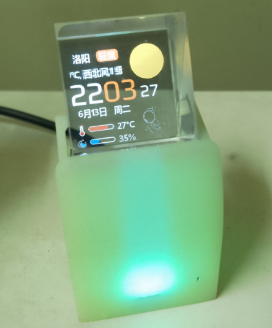
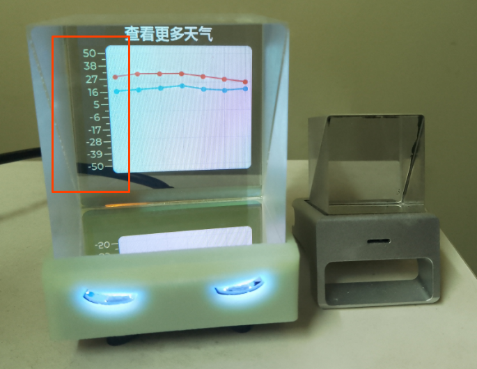

# 临时更新 v2.1.6.x

备注：v2.1.6.x为临时修改版本（4位版本号）【by：神秘藏宝室】

等待AIO作者：溜马小哥 有空时候更新会发布正式版本（3位版本号）

```
//v2.1.6.3
修复API接口

#define AIO_VERSION "2.1.6.2"
//修改by：神秘藏宝室
//v2.1.6.2
//修正Weather最高和最低温度显示

//v2.1.6.1
//修复Weather的API，原来的API已废弃
//修复Weater的第二页y轴坐标显示
//默认开启性能模式【第一次烧录，或者清空重新刷固件有效】
```


## 更新1：修复Weather的API，原来的API已废弃



## 更新2：修复Weater的第二页y轴坐标显示

