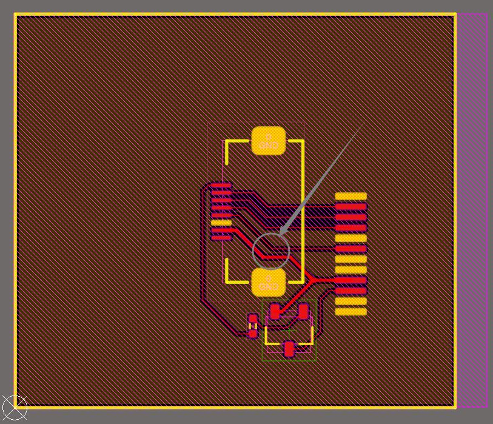
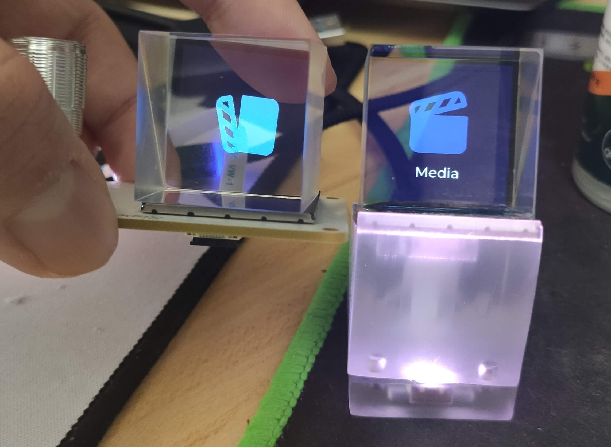

# 关于硬件部分的问题汇总
__本文件出自`HoloCubic AIO多功能固件`群755143193，由ClimbSnail（B站：溜马小哥）汇总。__

透明小电视简介 https://www.bilibili.com/video/BV1jh411a7pV?p=6

### 一、硬件版本
##### 概述
稚晖君一共有四个版本，透明底座版本`Naive`、`metal`、钢铁侠版本`Ironman`和`BiliBili天使底座`，群友大多数使用的是透明底座`Naive`版本。

很多大佬写了`Holocubic固件`，各版本固件基本通用这两个硬件版本（至少AIO固件是全兼容的）。要做哪个版本大家自行选择。holocubic原作者`稚晖君`的部分电路是存在问题的，群里有改良过的版本。

重要！硬件只支持`2.4G`的wifi。`5G`以及`双频合一`的都不支持。任何固件都无法突破硬件的限制。

注：对于没有电子基础又想玩的，可以询问下群友，部分群友是有转让或售卖的成品。

### 二、硬件相关
本群改进的各个版本PCB以及底座都在`硬件外壳相关`文件夹中分类打包好了，可自行下载。各个硬件版本的PCB与各种外壳可能存在不兼容的情况（有可能装不进去），请尽可能使用同一个压缩包内的文件惊进行制作并仔细阅读其中的版本说明。

##### 元器件购买
1. 大多数元件在淘宝的`优信电子`都可以购买到。
2. 主板上的`AN5120`天线不好搜到，推荐直接买`优信电子`的`AN2051`2.4G天线。
3. 屏幕与主板连接使用FPC座，购买FPC座规格`间距0.5 8P 翻盖下接`和FPC排线规格`间距0.5 8P同向 6cm`。
4. 棱镜与屏幕、屏幕拓展板与底座胶合，都推荐使用`B7000胶`或者`UV胶`。注：`UV胶`需要额外购买固化灯。棱镜贴合视频教程 https://www.bilibili.com/video/BV1jh411a7pV?p=5
5. 稚晖君原版的`naive`和`钢铁侠Ironman`内存卡卡槽型号都是`DM3D-SF`（淘宝少，比较贵）。群内硬件是内存卡槽改进版的`naive`和`metal`通用主板，卡槽为翻盖，链接在群共享文档中。

##### Naive透明底座版本硬件
1. 主板（与metal是同款主板）如要制作请使用群中改良的电路文件。（注：原版使用的卡槽不好卖且设计的C7电容为`0.1uf`是设计缺陷，原理图里提示的"第一次短接"的结论是错的，无法本根解决自动下载。需要C7换成`1uf~10uf`即可解决问题，任何时候都不需要短接操作。）
2. 如下图，原拓展板GND使用的是覆铜连接，而中间连个铜只有箭头指向的位置是相连的，加工PCB的时候很容易导致没能连上，于是GND断路，现象是屏幕背光都不亮。这里推荐使用群文件修改过的硬件PCB文件进行打样。

3. `主板`和`拓展板`板厚跟外壳有关。具体见各个版本的外壳推荐尺寸。

##### metal透明底座版本硬件
1. 主板（与naive是同款主板）如要制作请使用群中改良的电路文件。（注：原版使用的卡槽不好卖且设计的C7电容为`0.1uf`是设计缺陷，原理图里提示的"第一次短接"的结论是错的，无法本根解决自动下载。需要C7换成`1uf~10uf`即可解决问题，任何时候都不需要短接操作。）
2. 如下图，原拓展板GND使用的是覆铜连接，而中间连个铜只有箭头指向的位置是相连的，加工PCB的时候很容易导致没能连上，于是GND断路，现象是屏幕背光都不亮。这里推荐使用群文件修改过的硬件PCB文件进行打样。

3. `主板`和`拓展板`板厚跟外壳有关。具体见各个版本的外壳推荐尺寸。

##### Ironman钢铁侠版本硬件
1. 屏幕与主板使用的是`gopin弹簧顶针`连接，规格：`8Pin双排`、间距`2.54`、高`7mm`。
2. 屏幕板的顶针孔存在偏小的问题，需要自行扩一下。
3. `主板`和`拓展板`板厚跟外壳有关。具体见各个版本的外壳推荐尺寸。

##### BiliBili天使底座版本硬件
群内只有部分群友制作过，有意可以在群内问问看。

### 三、外壳的3D打印
##### Naive透明底座（改进版）
1. 适用于`Naive`版本硬件。
2. 原设计方案是使用螺丝连接上下壳，但群里有大佬磁吸改良版（磁铁为3*3mm圆形磁铁）推荐使用改良版。
3. 底座使用的是3D打印机制作的，建议使用半透明的打印效果。
4. 打印出来的表面如果想做成磨砂的效果，推荐先使用400目后配合800目的砂纸在水龙头冲洗下打磨。
5. 如果找网上代打的，注意公差，壳子小了主板是放不进去的。
6. 主板板厚`1.2mm`（使用改良版外壳）。拓展板板厚`1.2mm`。
##### Metal底座（改进版）
1. 适用于`NMetal`版本硬件。
2. 由于棱镜粘合的是玻璃屏幕，晃动即有可能损坏，故有群友分享了加固版底座（推荐）。推荐主板板厚`1.2mm`。拓展板板厚`1.2mm`。
##### Ironman钢铁侠底座
1. 适用于`Ironman`版本硬件。
2. 稚晖君原版底座推荐：主板板厚`1.0mm`。拓展板板厚`1.0mm`。
##### BiliBili底座
暂无

### 三、内存卡的选择
固件对内存卡有一定的兼容性问题，并不是所有都兼容。推荐以下已验证的内存卡。
1. 爱国者32G普通卡。淘宝大概20块钱。（性价比高，推荐）
2. 闪迪32G普通卡。淘宝大概30。

### 四、屏幕问题
屏幕的规格：1.3寸，驱动为ST7789 分辨率为240*240，焊接式12Pin。

这样的屏幕网上有很多，但对于制作holocubic来说需要选择好，屏幕将会影响整体的显示效果。目前测试了很多家屏幕，效果最好的就是中景园的。不推荐其他家的屏幕用来制作Holocubic。

###### 下面来实际比对下（请忽略背景差异）：
左边：中景园(翰彩)   右边：优智景

两个屏幕贴上棱镜后的差距主要在于`优智景`显示的周围空白区域严重偏蓝，很影响最终的效果。`中景园`的空白区域显示就很纯净。注：实际上中景园底色也偏蓝，但很轻微。

关于亮度问题（与屏幕无关）：
上图也可以看到，左边的明显亮度高，这是由于左边没有撕掉出厂偏光片带的保护膜（能增大亮度），同时左边的色彩由于保护膜的折射变得极其不准确。做过实现的同学还会发现，在撕掉保护膜后，棱镜`X轴`放置和`Y轴`放置亮度是不一样的。人眼对色彩相较于亮度来说还是比骄敏感的，个人建议撕掉保护膜。当然，如果更在意亮度也可以不撕掉保护膜，买屏幕的时候可以要求卖家发货的时候带保护膜且不要给保护膜贴那个绿色的标签。

### 五、关于焊接
1. 由于主板的封装以及紧凑的排布，导致焊接过程中很容易出现部分引脚没焊上或虚焊。请认真。
2. 钢铁侠版本硬件，大多数屏幕板是金属外壳，注意短路问题。
3. 在测试主板的时候，推荐使用`AIO固件`的全套工具进行测试，刷机前请安装好CP2102驱动，如果使用`AIO上位机`刷机时卡住不动，请检查主板（不要怀疑工具或者固件）。
4. 刷机成功也不意味着硬件完全没问题。如果iic线路焊接有问题，就会导致陀螺仪用不了切换不了页面。如果内存卡不兼容就会导致读取不了内存卡或者`holocubic`重启。具体问题定位，请直接查看`AIO上位机`的打印信息来判断哪部分存在问题，或者截图打印信息问群友。

### 六、尾篇
有问题多看文档，文档没有提的再问群友。最后，祝大家都能顺利用上`Holocubic`。