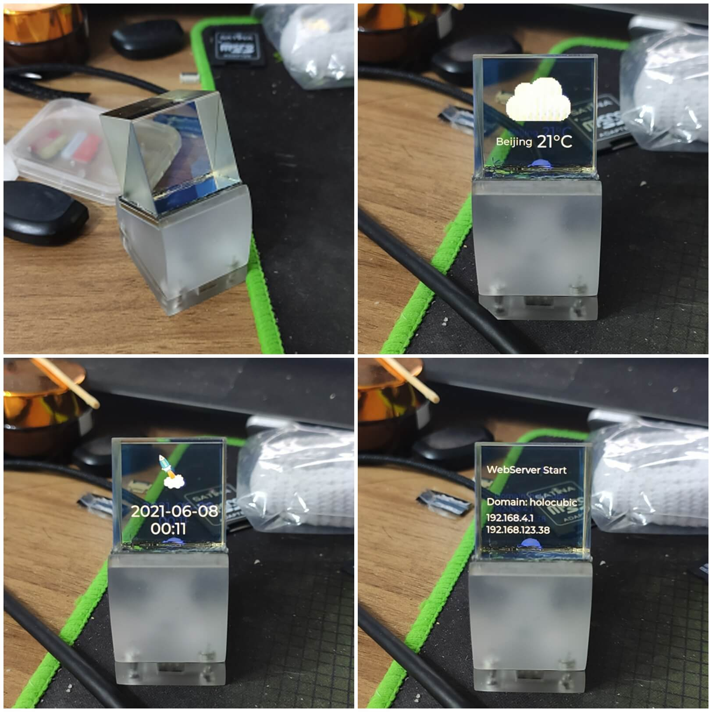

# HoloCubic_AIO (All in one for HoloCubic)

* 原作者的项目链接 https://github.com/peng-zhihui/HoloCubic
* 本项目的地址 https://github.com/ClimbSnail/HoloCubic_AIO （最新版本）
* 或者 https://gitee.com/ClimbSnailQ/HoloCubic_AIO

# 开发人员
* AIO框架开发和部分APP编写：[ClimbSnail](https://github.com/ClimbSnail)
* 2048游戏应用开发：[AndyXFuture](https://github.com/AndyXFuture)
* 开发人员持续加入中。。。。

_**欢迎加入AIO内测QQ讨论群 755143193**_


### 主要特点
1. 聚合多种APP，内置天气、时钟、相册、特效动画、视频播放、电脑投屏、浏览器文件修改。（各APP具体使用参考说明书）
2. 开机无论是否插接tf卡、mpu6050是否焊接正常、是否连接wifi（一定要2.4G的wifi），都不影响系统启动。
3. 程序相对模块化，低耦合。
4. 提供web界面进行配网以及其他设置选项。注：具体操作参考`APP介绍`
5. 提供web端连入除了支持ip访问，也支持域名直接访问 http://holocubic
6. 提供web端的文件上传到SD卡（包括删除），无需拔插SD来更新图片。
7. 提供全套上位机软件，并开源上位机源码。 https://github.com/ClimbSnail/HoloCubic_AIO_Tool

### 本固件基于前人的UI与灵感，设计了一套低耦合框架，更有利于多功能的实现
B站功能操作演示视频链接 https://www.bilibili.com/video/BV1jh411a7pV?p=1

[^_^]:
	


[^_^]:
	


[^_^]:
	


[^_^]:
	


### 固件刷写工具（无需搭建任何IDE环境）
下载群中的上位机进行刷机。
1. `bootloader_dio_40m.bin`启动的`bootloader`。
2. `partitions.bin`分区文件
3. `boot_app0.bin`
4. 最新的固件`HoloCubic_AIO_XXX.bin`

其中`HoloCubic_AIO_XXX.bin`文件随着每次版本更新而更新，其他三个文件基本不会变动。

将以上前三个文件与`CubicAIO_Tool.exe`放在同一个目录下，双击运行`CubicAIO_Tool.exe`，软件中选择最新的固件`HoloCubic_AIO_XXX.bin`，即可刷写固件。

上位机操作演示视频链接 https://b23.tv/5e6uDh

本上位机与AIO固件一样，坚持开源，开源地址：https://github.com/ClimbSnail/HoloCubic_AIO_Tool

[^_^]:
	


### 功能切换说明：
1. TF卡的文件系统为fat32。如果准备使用内存卡，在使用内存卡前最好将本工程中`放置到内存卡`目录里的所有文件和文件夹都放在TF卡的根目录。
2. 插不插tf内存卡都不影响开机，但影响某些APP的功能（各自APP介绍里会说明）。
3. 左右摇晃即可切换选择各类APP。
4. 向前倾斜1s钟即可进入当前页的APP应用，今后还会整合更多功能，同样后仰1s即退出该APP。

### APP介绍

##### 网页配置服务（Web Server）
1. 运行条件：无。注：wifi等信息是保存在flash中，内存卡完全不影响wifi功能的连接。
2. 启用后，会显示`Web Sever Start`。若当前模式为STA模式（此前已经连接过wifi），则WebServer建立在STA模式下的`Local_IP`上。若为AP模式（重没连接过wifi），则建立在`AP_IP`上（屏幕的服务界面有标注），AP模式的热点名为`HoloCubic_AIO`无密码。
3. 开始使用时，应让电脑与`HoloCubic`处于同一网络环境（同网段）。如果之前没连接过wifi则需要使用电脑连接HoloCubic放出的热点名为`HoloCubic_AIO`无密码的wifi。如果`Holocubic`已经连接上路由器，则电脑应当也连上该路由器。
4. 在浏览器地址栏输入`Local_IP`或者`AP_IP`（也支持域名直接访问 http://holocubic ），即可进入管理设置后台。推荐使用`ip地址`访问。
5. 网页里可设置屏幕方向。

##### 相册（Picture）
1. 运行APP条件：必须插内存卡，内存卡的根目录下必须存在`image/`目录（也可以使用`Web Server服务`APP 通过浏览器上传照片），`image/`目录下必须要有图片文件（jpg或者bin）。
2. 将需要播放的图片转化成一定格式（.jpg或.bin），再保存在`image/`目录中。
3. 使用固件进入相册APP后，将会读取`image/`目录下的图片文件。

关于图片转换：使用附带的上位机转化（分辨率随意，软件会自动压缩到指定分辨率）。
* 常用的天气图片，转换为c数组，格式为Indexed 16 colors 选择 C array。
* 不常用的图片则可以转换成（True color with alpha 选择Binary RGB565）bin文件存储到SD卡中，这样可以省下一些程序存储空间用来增加功能。支持转化为jpg图片。

##### 视频播放（Media）
1. 运行APP条件：必须插内存卡，内存卡的根目录下必须存在`movie/`目录。
2. 将所需要播放的视频（最好长宽比是1:1），使用本固件配套的使用转化工具转化为目标文件（mjpeg或者rgb格式都可），存放在`movie/`目录下。
2. 运行播放器APP后，将会读取`movie/`目录下的视频文件。

##### 屏幕分享、电脑投屏（Screen share）
1. 运行APP条件：无需内存卡，但需要利用`Web Server服务`app设置wifi密码（确保能连上路由器）。为避免wifi连接时，功率不够导致重启，请确保USB口供电充足。
2. 上位机目前使用第三方软件，后期会独立编写投屏上位机，提高性能。
3. 本投屏上位机使用的是[大大怪](https://gitee.com/superddg123/esp32-TFT/tree/master)的上位机。

##### 天气、时钟（Weather）
1. UI设计模仿了[CWEIB](https://github.com/CWEIB)
2. 运行APP条件：必须是已经联网状态。不插内存卡大多数情况能正常工作。
3. 一般情况下不插内存卡也可以工作，但部分天气图标是存在内存卡中（由于内部flash不够用）的，需要将固件附带的`weather/`文件夹复制到tf卡根目录。
4. 需要再"Web Server"服务中修改知心天气的地址、key（私钥）。（申请地址 https://seniverse.com ，文件里附带key是范例，无法直接使用。程序默认使用的是v3版本的api）

注：即使断网后，时钟也依旧运行。（开机最好连接wifi，这样会自动同步时钟。使用中会间歇尝试同步时钟）

##### 特效动画（Idea）
1. 运行APP条件：无。内置的几种特效动画。

注：移植群友"小飞侠"的功能，在此感谢！


##### 文件管理器（File Manager）
1. 运行APP条件：必须是已经正常配置wifi。必须插内存卡。为避免wifi连接时，功率不够导致重启，请确保USB口供电充足。目前部分功能还在开发中。
2. 进入`Holocubic`文件管理器后会自动连接已配置的wifi，并显示出IP地址。
3. 在上位机的文件管理器软件中填入自己`Holocubic`的IP地址（端口可以不用改），点击连接。

##### 2048 APP
1. `2048`游戏由群友`AndyXFuture`编写，并同意合入AIO固件。原项目链接为`https://github.com/AndyXFuture/HoloCubic-2048-anim`
2. 运行APP条件：无。基本屏幕能亮就行。
3. 操作注意：游戏中`向上`和`向下`操作由于与原`进入`和`退出`为同一个动作，系统已操作时长为区分动作，游戏中`向上`和`向下`正常操作即可，`进入`和`退出`需要倾斜1秒中方可触发。

##### BiliBili APP
1. 运行APP条件：必须是已经正常配置wifi。为避免wifi连接时，功率不够导致重启，请确保USB口供电充足。目前功能还在开发中。


### 关于编译工程代码
1. 本工程代码是基于vscode上的PlatformIO插件中的ESP32-Pico的Arduino平台开发。具体教程可以上`B站`找。推荐教程[https://b23.tv/kibhGD](https://b23.tv/kibhGD)
2. 记得修改工程下`platformio.ini`文件中`upload_port`字段成对应自己COMM口。
3. 然后这里需要修改一个官方库文件才能正常使用：

PlatformIO和ArduinoIDE用户都需安装ESP32的Arduino固件支持包（百度有海量教程）。不管哪种开发方式都需要修改`SPI`库中的`MISO`默认引脚为`26`，例如arduinoIDE的包路径为`esp32\hardware\esp32\1.0.4\libraries\SPI\src\SPI.cpp`文件中，**修改以下代码中的MISO为26**：
```
    if(sck == -1 && miso == -1 && mosi == -1 && ss == -1) {
        _sck = (_spi_num == VSPI) ? SCK : 14;
        _miso = (_spi_num == VSPI) ? MISO : 12; // 需要改为26
        _mosi = (_spi_num == VSPI) ? MOSI : 13;
        _ss = (_spi_num == VSPI) ? SS : 15;
```
这是因为，硬件上连接屏幕和SD卡分别是用两个硬件SPI，其中HSPI的默认MISO引脚是12，而12在ESP32中是用于上电时设置flash电平的，上电之前上拉会导致芯片无法启动，因此我们将默认的引脚替换为26。

### 程序框架图

[^_^]:
	


AIO框架讲解链接 https://www.bilibili.com/video/BV1jh411a7pV?p=2

关于UI的设计可以自行关注下`Edgeline
`、`gui-guider`等工具。

platformIO模拟器 https://github.com/lvgl/lv_platformio

应用图标(128*128)：可以下载阿里矢量图 https://www.iconfont.cn/

调试过程中报错定位代码：`xtensa-esp32-elf-addr2line -pfiaC -e 固件名.elf Backtrace地址信息`

关于lvgl的学习参考：`http://lvgl.100ask.org`、`http://lvgl.100ask.net`

lvgl的字体生成可以使用：`LvglFontTool V0.4` 已放置在Doc目录下

### 致谢
* ESP32内存分布 https://blog.csdn.net/espressif/article/details/112956403
* 视频播放 https://github.com/moononournation/RGB565_video
* 感谢`lib`目录下所用到的开源库相关的作者
