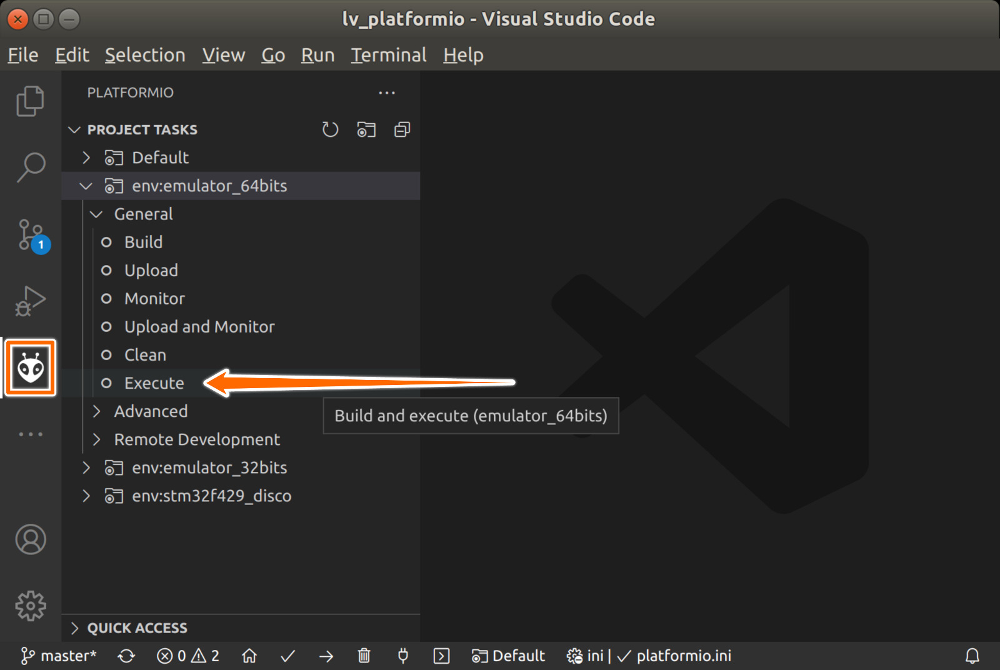

# Run LittlevGL via PlatformIO

[](https://github.com/lvgl/lv_platformio/actions)

This demo should help you to organize your project with awesome PlatformIO IDE.

1. It automates installing everything - just open folder with this project in
   [vscode](https://code.visualstudio.com/), and agree to install all it offers.
2. It contains working LittlevGL demo, runnable on both are metal and PC.
3. It has example, how to configure PlatomIO.


## How to install & use demo

### Install Visual Studio Code

https://code.visualstudio.com/ - follow instructions there, if you don't have
vscode yet.


### Install SDL drivers

**Linux (Ubuntu, Debian, ...)**

Use one of options below:

```sh
# 64 bits
sudo apt-get install libsdl2-dev
```

```sh
# 32 bits
sudo apt-get install gcc-multilib g++-multilib libsdl2-dev:i386
```

Note:

- Use 32-bits build for more correct memory stat info.
- If you have conflicts on `libsdl2-dev:i386` install, remove 64-bits version
  and dependencies first.

**MacOS**

Use [Homebrew](https://brew.sh/):

```sh
brew install sdl2
```

**Windows**

Use [MSYS2](https://www.msys2.org/)

```sh
pacman -S mingw-w64-x86_64-gcc mingw-w64-x86_64-SDL2
```

Add the path to your Mingw-w64 `bin` folder to the Windows PATH environment
variable (usually `C:\msys64\mingw64\bin`). See [instruction, 4](https://code.visualstudio.com/docs/cpp/config-mingw#_prerequisites).


### Install flasher drivers (optional)

If you plan to upload firmware & debug hardware, read notes in PlatformIO
[install docs](http://docs.platformio.org/en/latest/installation.html#troubleshooting).


### Build/Run

1. Clone this repository or download as zip.
2. In vscode, open folder via `File` -> `Open Folder...` menu.
   - If you do it first time - agree, when it suggests to install PlatformIO
     plugin, and wait when PlatformIO then install build tools and package
     dependencies.

To build/execute, on PlafomIO tab expand desired env and click target:



Note, for emulator env `upload` also executes compiled binary.
